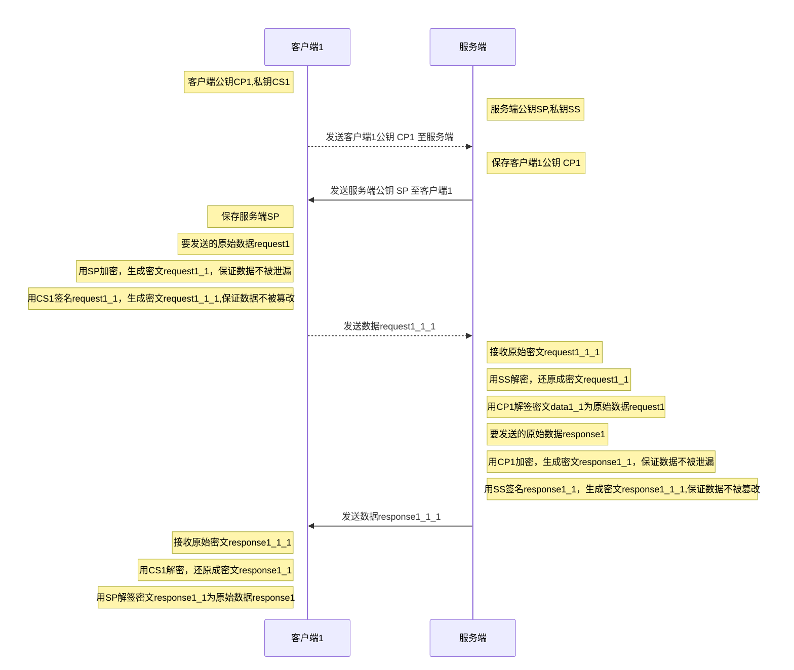
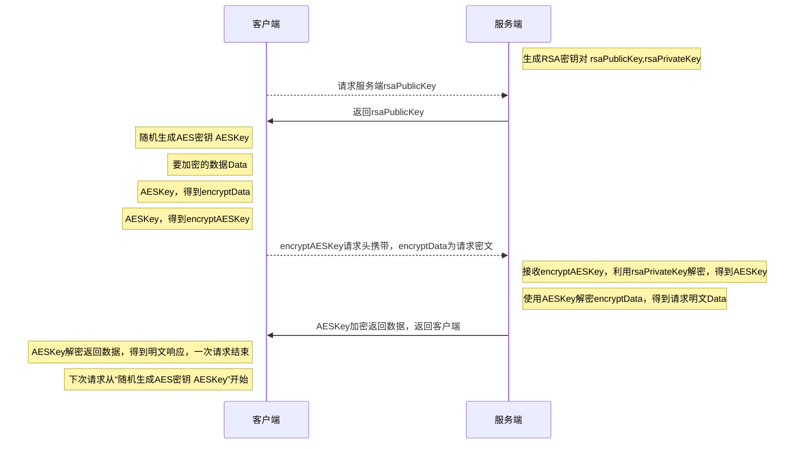

### RSA加解密流程

```mermaid

  sequenceDiagram
  	Title:   
    participant 客户端1
    participant 服务端
    Note left of 客户端1:客户端公钥CP1,私钥CS1
   	Note right of 服务端:服务端公钥SP,私钥SS
    
    
    客户端1-->>服务端:发送客户端1公钥 CP1 至服务端
    Note right of  服务端:保存客户端1公钥 CP1
    
    服务端->>客户端1:发送服务端公钥 SP 至客户端1
    Note left of  客户端1:保存服务端SP 
    
    Note left of 客户端1:要发送的原始数据request1
    Note left of 客户端1:用SP加密，生成密文request1_1，保证数据不被泄漏
    Note left of 客户端1: 用CS1签名request1_1，生成密文request1_1_1,保证数据不被篡改
    客户端1-->>服务端:发送数据request1_1_1
    
    Note right of 服务端:接收原始密文request1_1_1
    Note right of 服务端:用SS解密，还原成密文request1_1
    Note right of 服务端: 用CP1解签密文data1_1为原始数据request1
    
    
    Note right of 服务端:要发送的原始数据response1
    Note right of 服务端:用CP1加密，生成密文response1_1，保证数据不被泄漏
    Note right of 服务端: 用SS签名response1_1，生成密文response1_1_1,保证数据不被篡改
    服务端->>客户端1:发送数据response1_1_1
    
    Note left of 客户端1:接收原始密文response1_1_1
    Note left of 客户端1:用CS1解密，还原成密文response1_1
    Note left of 客户端1: 用SP解签密文response1_1为原始数据response1
    

```

### 实际应用加密流程

非对称加密，算法复杂，计算速度慢，消耗资源多，不适合加密长数据，但是对称加密存在数据被截取的风险，因此实际应用中可以对称、非对称加密配合使用。以AES和RSA其中一种配合举例说明：

```mermaid
sequenceDiagram
participant 客户端
participant 服务端
Note right of 服务端:生成RSA密钥对 rsaPublicKey,rsaPrivateKey
客户端-->>服务端:请求服务端rsaPublicKey
服务端->>客户端:返回rsaPublicKey
Note left of 客户端:随机生成AES密钥 AESKey
Note left of 客户端:要加密的数据Data
Note left of 客户端:AESKey，得到encryptData
Note left of 客户端:AESKey，得到encryptAESKey
客户端-->>服务端:encryptAESKey请求头携带，encryptData为请求密文
Note right of 服务端:接收encryptAESKey，利用rsaPrivateKey解密，得到AESKey
Note right of 服务端:使用AESKey解密encryptData，得到请求明文Data
服务端->>客户端:AESKey加密返回数据，返回客户端
Note left of 客户端:AESKey解密返回数据，得到明文响应，一次请求结束
Note left of 客户端:下次请求从“随机生成AES密钥 AESKey”开始


```

